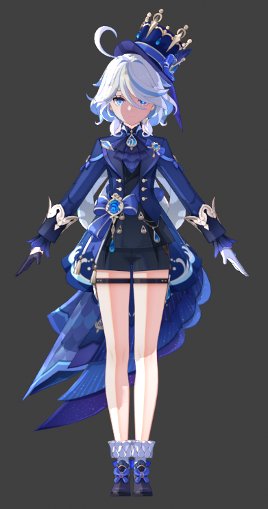
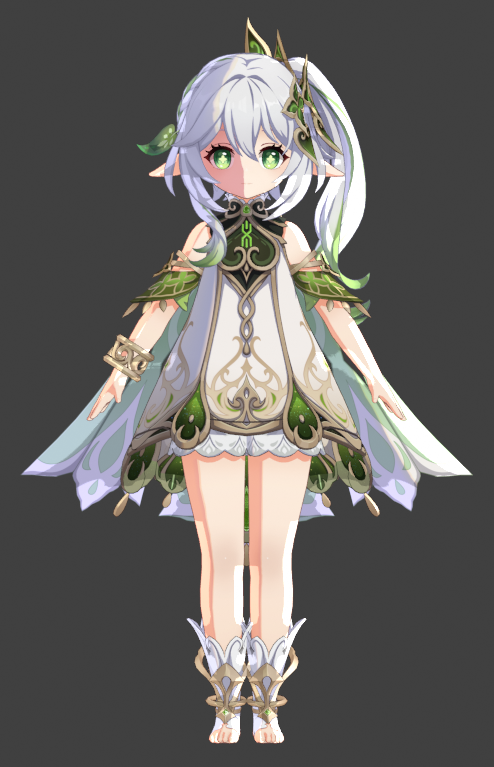
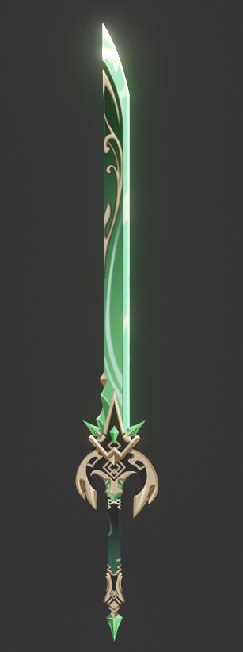
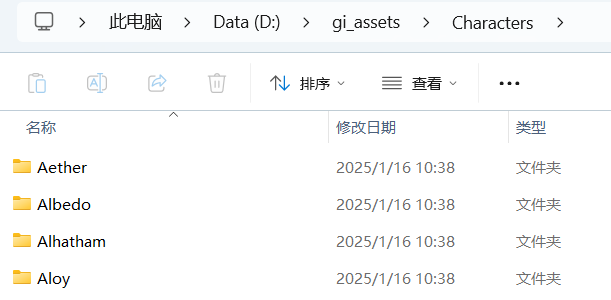
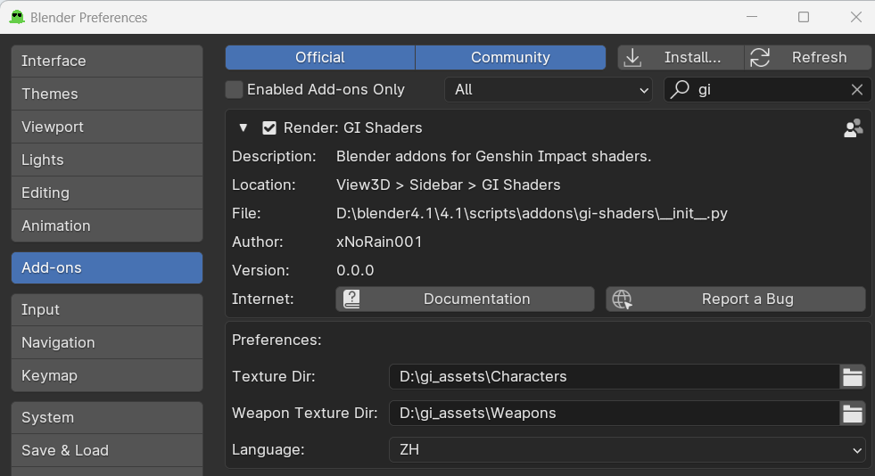
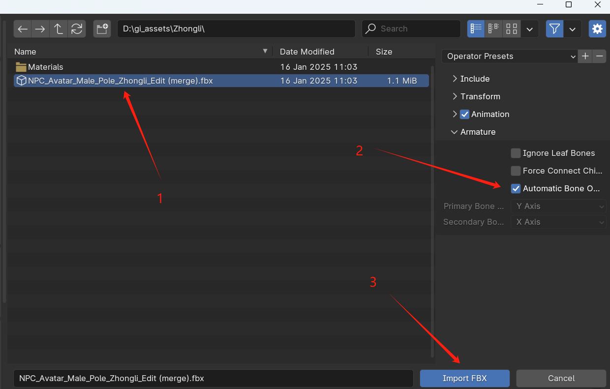
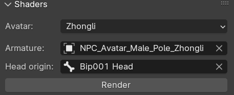
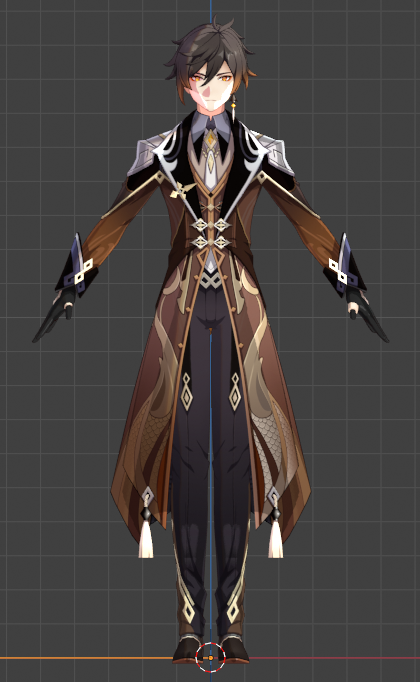
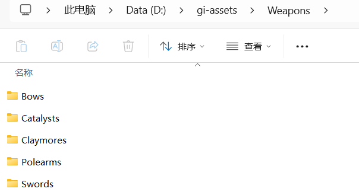
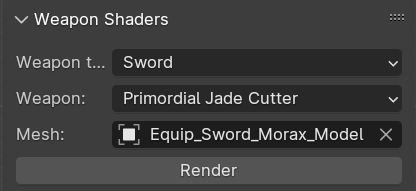

# GI Shaders
[English](README.md) | [简体中文](README.zh-cn.md)

## Introduction
Blender addon for Genshin Impact shaders (based on Festivity's [`Blender-miHoYo-Shaders`](https://github.com/festivize/Blender-miHoYo-Shaders)) .

## Preview

  
  
  

## Usage

### Render avatar

1. Download [`GI-Assets`](https://github.com/zeroruka/GI-Assets/tree/main/Models/Characters), My download dir is `D:\gi_assets\Characters`(Download as needed)

2. Go to the [Releases](https://github.com/xNoRain001/gi-shaders/releases) page and download the latest gi-shaders.zip
3. Open Blender (`Goo Engine v4.1.0`)
4. Install Addon (Edit > Preferences > Install > Select gi-shaders.zip)
5. Config preferences, texture dir choose download assets dir

6. `Restart blend`(After change texture dir, must restart.)

6. Create new blend file and import model, File -> Import -> FBX 

7. Alt + S to reset model size
8. Open up the N-Panel (Hit the 'N' key) and select the `GI Shaders` tab
9. Choose avatar, armature, head origin

10. Click render button

### Render weapon

1. Download [`GI-Assets`](https://github.com/Hoyotoon/HoyoToon-Assets/tree/main/Genshin%20Impact/Weapons), My download dir is `D:\gi_assets\Weapons`(Download as needed)

2. Render

