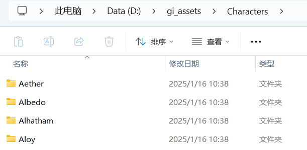
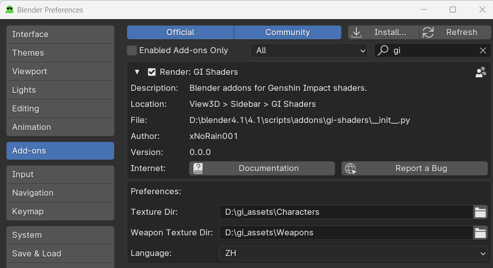

# GI Shaders
[English](README.md) | [简体中文](README.zh-cn.md)

## 介绍
Blender 原神三渲二插件（基于 Festivity 的 [`Blender-miHoYo-Shaders`](https://github.com/festivize/Blender-miHoYo-Shaders)）。

## 预览

  
  

## 使用

1. 下载 [`GI-Assets`](https://github.com/zeroruka/GI-Assets/tree/main/Models/Characters), 我的下载路径是 `D:\gi_assets`

2. [Releases](https://github.com/xNoRain001/gi-shaders/releases) 页面下载最新的 gi-shaders.zip
3. 打开 Blender (`Goo Engine v4.1.0`)
4. 安装插件 (编辑 > 偏好设置 > 安装 > 选择 gi-shaders.zip)
5. 设置材质路径

6. `重启 Blender`(改变配置后必须重启)

6. 创建一个新的 Blend 文件, 文件 -> 导入 -> FBX 

7. Alt + S 重置缩放
8. 打开侧边栏 (按下 N 键) 并且选择 `GI Shaders` 项
9. 选择角色, 骨架, head origin

10. 点击渲染按钮

